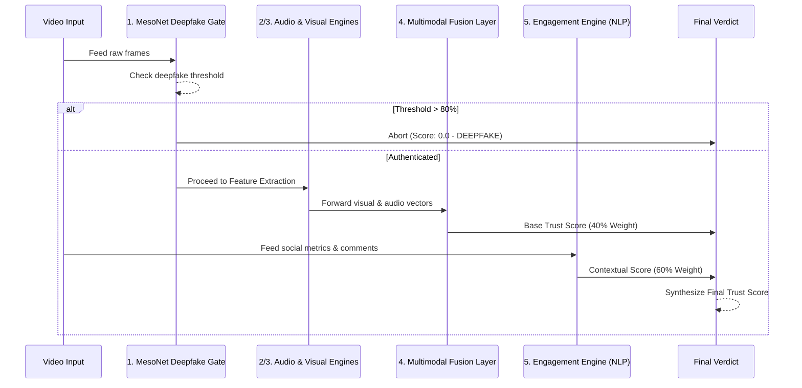

# 🛡️ TrueFluence
> **A Comprehensive Multimodal Scam & Deepfake Detection Platform**

TrueFluence is a full-stack, production-ready AI architecture designed to autonomously detect fraudulent influencer campaigns, deepfakes, and scam videos. By aggregating asynchronous inference gates, feature extraction across multiple modalities, and an advanced multimodal fusion layer, TrueFluence ensures content authenticity at scale. 

---

## 📁 Directory Architecture

TrueFluence adopts a decoupled, modular design to ensure scalable engineering habits and rapid deployment.

```text
📦 TrueFluence
 ┣ 📂 Multimodals/    # Core AI Engine (PyTorch, Transformers, MesoNet)
 ┣ 📂 Backend/        # Flask API connecting interfaces to the AI engine
 ┣ 📂 Frontend/       # Web-based user interface dashboard
 ┗ 📂 MobileApp/      # React Native (Expo) app featuring an Instagram-like video feed
```

---

## 🏗️ Multimodal AI Pipeline (System Design)

The core engine evaluates content via a strict **5-Step Sequential Pipeline** to calculate a final predictive "Trust Score" (0.0 to 1.0). 



### 1. MesoNet Deepfake Gate 🔍
* **Architecture**: Meso-4 (MesoNet architecture for Deepfake Detection).
* **Functionality**: Serves as a high-speed asynchronous inference gate extracting frames to calculate deepfake probability.
* **Gate Rule**: If the deepfake threshold exceeds **80%**, the pipeline aborts immediately and outputs a final score of `0.0` (⛔ DEEPFAKE), preventing unnecessary compute downstream.

### 2. Video Analysis Engine 🎥
* **Backbone**: MobileNetV2 for frozen ImageNet-pretrained feature extraction.
* **Quality Assessment**: Multi-layer MLP scoring video production quality per frame.
* **Temporal Analysis**: Bidirectional 2-layer LSTM and self-attention mechanism evaluating frame sequences over time for semantic consistency.

### 3. Audio Analysis Engine 🎵
* **Feature Extraction**: 128-dim vectors combining MFCCs, Chroma, Spectral, RMS, and Mel Bands.
* **Pattern Analysis**: Utilizes VGGish embeddings to evaluate voice authenticity, pause anomalies, and audio-visual consistency.

### 4. Multimodal Fusion Layer 🔗
* **Weighting**: Contributes **40%** to the final overarching score.
* **Architecture**: Concatenation-based MLP merging 135-dim visual and audio vectors. Defaults to an architectural penalty if the video lacks an audio track.

### 5. Comments & Engagement Engine 💬
* **Weighting**: Contributes **60%** to the final overarching score (capitalizing on social proof as a primary indicator of scam campaigns).
* **NLP (BERT)**: Deploys `bert-base-uncased` from Hugging Face Transformers to assess comment sentiment, detecting bot rings and real-user warnings.
* **Engagement Analytics**: Custom neural network weighing followers, likes, and comment volume ratios. Automatically integrates live engagement data via a matching `<video_name>.json` file.

---

## 📊 Verdict Confidence Matrix

| Score Range | Verdict | Indicator | Required Action |
| :--- | :--- | :---: | :--- |
| **0.0 – 0.3** | **SCAM / DEEPFAKE** | 🔴 | High alert. Immediate takedown required. |
| **0.3 – 0.5** | **LIKELY SCAM** | 🟠 | Highly suspicious. Flag for manual review. |
| **0.5 – 0.7** | **LIKELY REAL** | 🟡 | Borderline content. Monitor engagement. |
| **0.7 – 1.0** | **REAL** | 🟢 | Safe and authentic. |

---

## 🛠️ Quickstart & Local Deployment

### AI Engine (Multimodals) Environment Setup

```bash
cd Multimodals

# 1. Provision an isolated virtual environment
python -m venv .venv

# Activate environment (Windows)
.venv\Scripts\activate

# 2. Install core ML dependencies
pip install -r requirements.txt

# 3. Ensure Transformers is installed (Required for Comments Engine)
pip install transformers

# 4. Initialize architecture and download requisite MesoNet weights
python setup_project.py
```

### Data Ingestion & Inference

Place target test videos in `Multimodals/Test_Dataset/`. For social context inference, provide a matching `.json` file (e.g., `test_vid1.json`):

```json
{
  "followers": 50000,
  "likes": 5200,
  "comments": [
    "Amazing quality!", 
    "Is this a scam?", 
    "Not working."
  ]
}
```

Execute the evaluation pipeline:

```bash
cd Multimodals
python test.py
```
> *Outputs are formatted in the terminal and serialized to `results.txt` and `results.json`.*

### Pipeline Training

The visual and audio systems undergo sequential training across 4 phases to mitigate catastrophic forgetting. Await the completion of each phase before proceeding.

```bash
python train.py
```
> *Ensure `dataset/real_videos/` and `dataset/scam_videos/` are hydrated with data prior to execution.*

---

## ⚠️ Production Constraints & Engineering Nuances

To ensure transparency and highlight optimization vectors, the current iteration of TrueFluence acknowledges the following constraints:

* **Generalization Variance**: The visual and audio components were base-trained on a localized dataset. Inference on out-of-distribution environments may experience variance, presenting an opportunity for scaled distributed training.
* **Graceful Degradation**: The Comments Engine enforces a strict dependency on the `transformers` library. Should the environment fail to instantiate it, the pipeline silently falls back to a neutral `0.5` engagement score to maintain system availability.